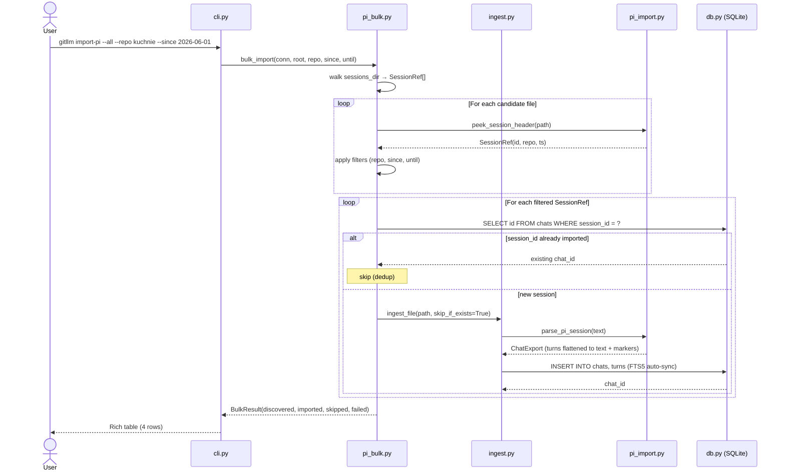
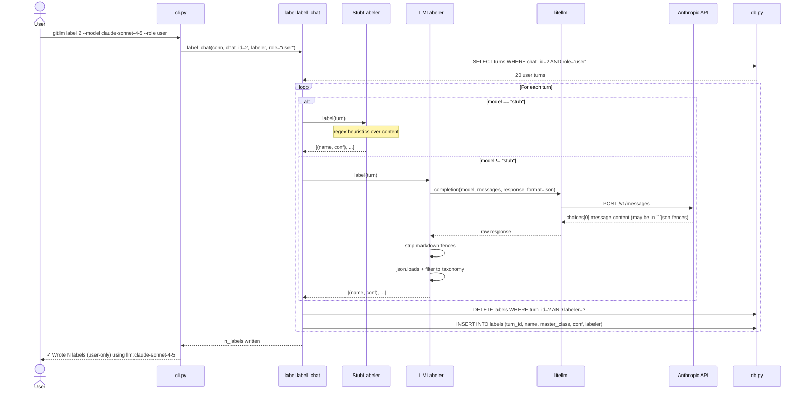
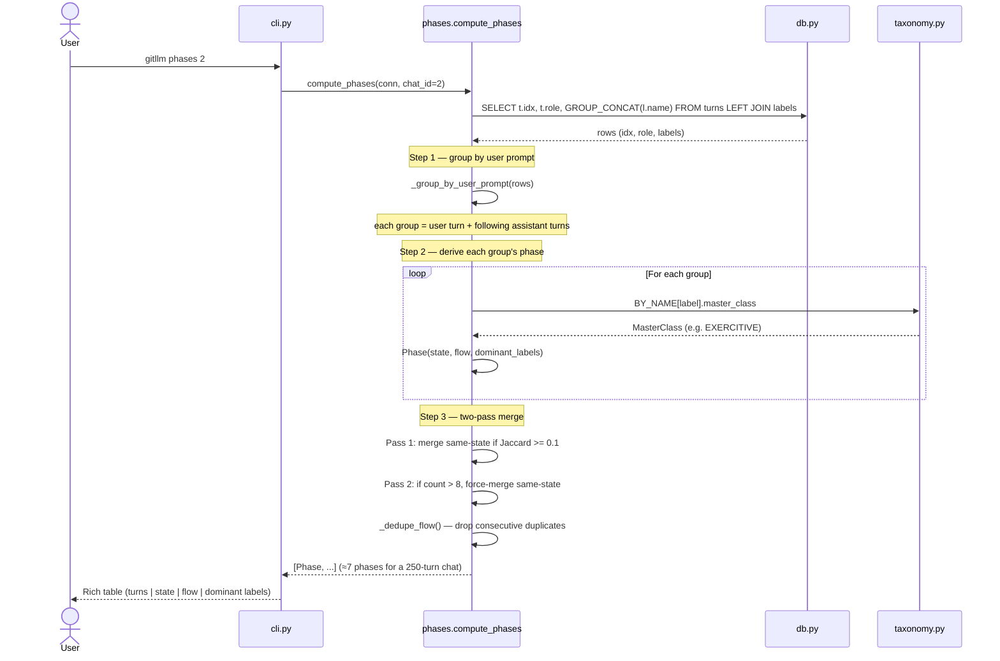
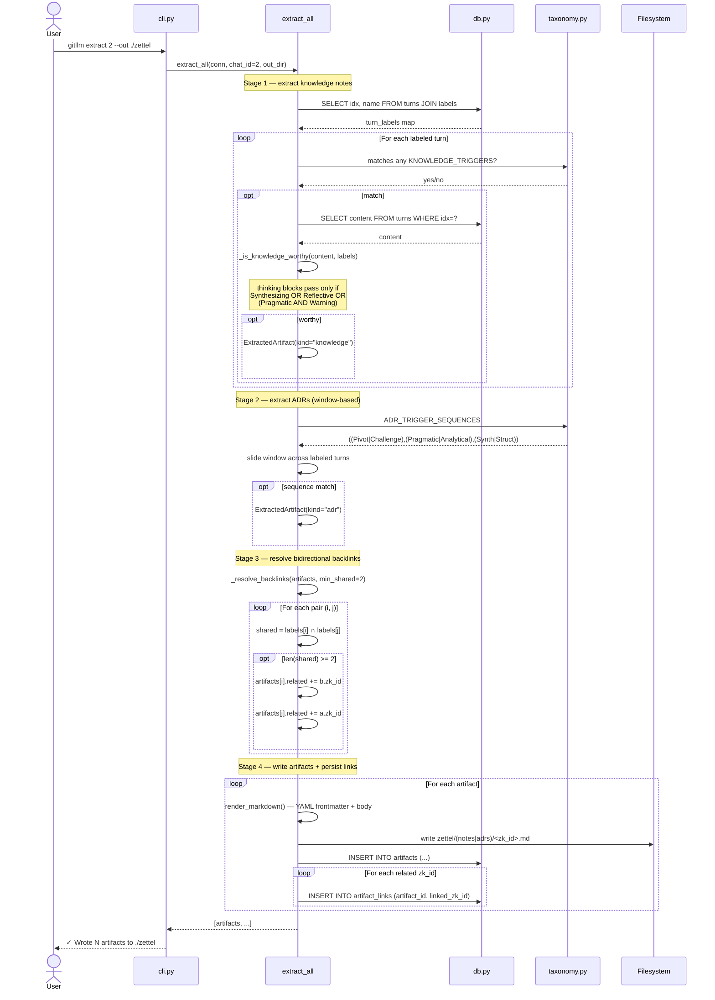
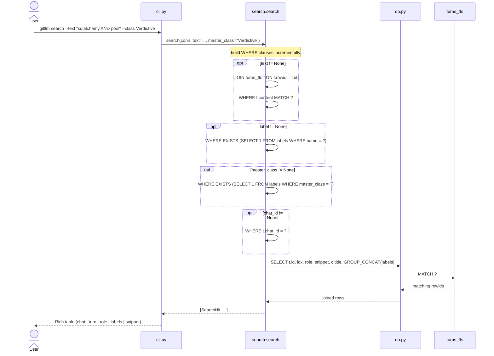

# Architecture

> Design rationale for `git-llm`. Last updated: 2026-06-28.

## 1. Problem framing

The user's `docs/initial-conversation.md` exposes a real operational problem
(recall / navigation / signal-vs-noise / extraction across many LLM chats) and
proposes a 20-label taxonomy as the solution. Critique: a taxonomy is *one
column* in the system you need; the pipeline around it (capture, store, query,
extract) is the bulk of the work and was missing.

`git-llm` implements that pipeline.

---

## 2. Architecture overview

`git-llm` is a **pipelined knowledge extraction system** for LLM conversations.
The design uses well-known patterns at each layer; this section names them
explicitly so future contributors can navigate by intent, not just by file.

### Layers and patterns

| Layer | Pattern | Implementation |
|---|---|---|
| Domain | Value Objects (frozen dataclasses) | `taxonomy.py`, `schema.py`, `models.py` |
| Storage | Repository + Unit of Work | `db.py` — `session()` context manager owns all SQL |
| Source adapters | Adapter | `pi_import.py`, `ingest.py` — provider format → `ChatExport` |
| Pluggable classifier | Strategy + Protocol | `Labeler` protocol with `StubLabeler` / `LLMLabeler` |
| Classification rules | Specification | `KNOWLEDGE_TRIGGERS`, `ADR_TRIGGER_SEQUENCES` in `taxonomy.py` |
| Multi-stage extraction | Template Method / Pipeline | `extract_all()` → extract → resolve backlinks → write |
| Backlink graph | Bidirectional Link | `_resolve_backlinks()` + `artifact_links` table |
| Schema evolution | Additive Migration | `_migrate()` runs before `CREATE TABLE IF NOT EXISTS` |
| Idempotency | Idempotency Key | `chats.session_id` partial unique index |
| Phase compression | Two-Pass Merge | Jaccard threshold pass + force-merge cap |
| Evaluation | Single Source of Truth | `rubric.yaml` drives human + AI scorecards |
| User interface | Facade | `cli.py` is the only stdout/stderr touchpoint |

### Component map

```
┌──────────────────────────────────────────────────────────────────┐
│                         CLI (Facade)                             │
│              cli.py — typer commands, Rich output                │
└──────────────────────────────────────────────────────────────────┘
                              │
┌─────────────────────────────┼────────────────────────────────────┐
│                             ▼                                    │
│  Service layer                                                   │
│  ┌──────────┐ ┌─────────┐ ┌─────────┐ ┌─────────┐ ┌──────────┐  │
│  │  ingest  │ │  label  │ │ phases  │ │ extract │ │  search  │  │
│  │ pi_import│ │ Labeler │ │  Phase  │ │ Artifact│ │   FTS5   │  │
│  │ pi_bulk  │ │ Strategy│ │ compress│ │ extract │ │  + label │  │
│  └──────────┘ └─────────┘ └─────────┘ └─────────┘ └──────────┘  │
│  ┌──────────┐  ┌─────────────────────────────────────────────┐  │
│  │ export   │  │  Off-pipeline tools (scripts/)              │  │
│  │ convert  │  │  scan_sessions, eval_kappa, eval_backlinks, │  │
│  │          │  │  eval_clusters, gen_session_view            │  │
│  └──────────┘  └─────────────────────────────────────────────┘  │
└──────────────────────────────────────────────────────────────────┘
                              │
┌─────────────────────────────┼────────────────────────────────────┐
│                             ▼                                    │
│  Storage layer (Repository)                                      │
│  db.py — schema, migrations, FTS5, session() context manager     │
└──────────────────────────────────────────────────────────────────┘
                              │
┌─────────────────────────────┼────────────────────────────────────┐
│                             ▼                                    │
│  Domain layer (pure, no IO)                                      │
│  taxonomy.py — 20 labels, master classes, triggers               │
│  schema.py   — TurnExport, ChatExport, ContentBlock              │
│  models.py   — DB-facing Pydantic models                         │
└──────────────────────────────────────────────────────────────────┘
```

### Deliberate non-decisions

- **No ORM.** Raw SQL with `sqlite3.Row` is fast enough and avoids leakage.
- **No DI framework.** Dependencies pass explicitly via function signatures.
- **No async.** The labeler is the only IO bottleneck and is naturally batched.
- **No microservices.** Single Python package, single SQLite file, single user.
- **No content embeddings (yet).** Backlinks and clustering use label overlap;
  content vectors are deferred until volume justifies the dependency.

---

## 3. Sequence diagrams

The five flows below cover the dominant pipelines. Together they describe
~90% of what the system does at runtime.

### 3.1 Bulk pi-session import (idempotent)



### 3.2 Labeling with role filter (stub vs LLM)



### 3.3 Phase compression (user-prompt grouping + two-pass merge)



### 3.4 Knowledge extraction with backlink resolution



### 3.5 Search (FTS5 + label + master-class filters)



---

## 4. Architecture Decision Records

### ADR-001: SQLite + FTS5 over a graph DB or Elasticsearch
- **Status:** Accepted
- **Context:** Personal-scale: ~10²–10³ chats × ~40 turns. Single user, local-first.
- **Decision:** SQLite with FTS5 (porter + unicode61 tokenizer).
- **Consequences:** Zero ops, single file, trivial backup, fast enough for
  10⁵ turns. Cost: no native graph queries — backlinks are modeled as a
  flat `artifact_links` table, which is adequate for Zettelkasten-style use.

### ADR-002: Keep the user's 20 labels; add Austin class as a column
- **Status:** Accepted
- **Context:** The user already has cognitive investment in 20 labels. A switch
  to MIDAS (~23) or SwDA (~42) mid-project would be churn.
- **Decision:** Persist `name` *and* `master_class` per label row. Store a
  `midas_hint` in code (not DB) for future migration.
- **Consequences:** Both axes are queryable (`--label Warning` or
  `--class Verdictive`). Migration to MIDAS is a SQL update, not a redesign.

### ADR-003: Pluggable Labeler protocol with offline stub
- **Status:** Accepted
- **Context:** Tests and air-gapped use must not require an API key.
- **Decision:** `Labeler` protocol with two implementations: `StubLabeler`
  (regex heuristics) and `LLMLabeler` (LiteLLM → any provider).
- **Consequences:** `pytest` is hermetic. Users pay only for production
  labeling. Labelers are tagged in the `labels.labeler` column, so multiple
  labelers can coexist (enables inter-annotator agreement later).

### ADR-004: Rule-based extraction over LLM-summarization
- **Status:** Accepted
- **Context:** LLM summarization is non-deterministic, expensive, and hides
  the labeling logic.
- **Decision:** Extraction triggers are explicit `(kind, label-set)` rules in
  `taxonomy.py`. Body content is the raw turn text — no summarization in v1.
- **Consequences:** Reproducible. The output of `extract` depends only on
  labels in the DB. LLM-based distillation can be added later as a separate
  `distill` command without touching extraction.

### ADR-005: Markdown + YAML frontmatter for Zettel notes
- **Status:** Accepted
- **Context:** Must integrate with Obsidian, Logseq, plain `grep`.
- **Decision:** Each note = `<zk_id>.md` with YAML frontmatter
  (`id`, `kind`, `source_chat`, `source_turns`, `labels`).
- **Consequences:** Tool-agnostic. Backlinks (`[[zk_id]]`) can be inserted
  by future enrichment without changing the storage format.

### ADR-006: JSONL is canonical exchange format; markdown is best-effort
- **Status:** Accepted (revises v0.1)
- **Context:** Markdown headings (`# user` / `# AI`) as turn boundaries are fragile:
  collisions inside code fences, no metadata, no multimodal, no edit history.
  Every real chat-export tool (OpenAI API, Anthropic API, ChatGPT export,
  Claude export) already produces JSON.
- **Decision:** Make **JSONL** (one `TurnExport` per line) the canonical
  **exchange format** — both the input format for non-pi sources and the
  output format for `gitllm export`. Accept JSON envelopes (`{messages: [...]}`)
  for direct provider compatibility. Keep markdown ingestion but harden it
  (skip code fences, require exact heading match) and ship `gitllm convert`
  to migrate users off markdown.
- **Schema:** mirrors the OpenAI/Anthropic `messages` shape — `role`,
  `content` (str or list of `ContentBlock`), plus optional `timestamp`,
  `model`, `id`, `parent_id`, `usage`, `metadata`. System messages are dropped
  at ingest; non-text blocks (`image`, `tool_use`, `tool_result`) are preserved
  as text markers so turn count and ordering are stable.
- **Consequences:** Round-trip safe with provider APIs. JSONL is
  append-only friendly, streamable, and diff-friendly. Markdown remains
  available for copy-paste but emits a clear migration command.

### ADR-007: Adopt pi-session lessons via additive schema, not full mirror
- **Status:** Accepted
- **Context:** The `pi-session-export` skill stores agent sessions as JSONL
  with a richer shape than ours: per-line `type` envelope, DAG via
  `parentId`, first-class `thinking` blocks, per-turn `usage` + cost,
  mid-session control events (`model_change`, `thinking_level_change`).
  Full comparison was done by reading real `~/.pi/agent/sessions` files.
- **Decision:** Adopt the *capabilities* that improve labeling and
  extraction; reject the structural choices that are agent-runtime-specific.
  Specifically:
  - **Adopted (additive to `TurnExport`):**
    - `parent_id: str | None` — DAG edge; enables branch analysis without
      forcing a tree on linear chats.
    - `usage: UsageInfo | None` — input/output/cache tokens + cost.
    - `ContentBlock(type="thinking", thinking=str)` — reasoning traces
      are first-class, FTS-indexed, and surfaced with a `[thinking]`
      marker in `to_text()` so the labeler can distinguish them.
  - **Rejected:**
    - Heterogeneous line-type envelope (`type` field per line). Pi needs
      this because it logs a live agent. We capture finished conversations
      — one schema per line keeps JSONL grep/diff/validation simple.
    - camelCase keys (`toolCall`, `cacheRead`). We follow OpenAI/Anthropic
      snake_case so provider logs ingest unmodified.
  - **Translated, not adopted:**
    - `model_change` / `thinking_level_change` → buffered and attached to
      the *next* message as `metadata.control_events`.
    - `api`, `provider`, `stopReason`, `responseId` → `metadata`.
- **Consequences:** A new `pi_import.parse_pi_session()` adapter performs
  lossless translation. Pi sessions auto-detect in `parse_jsonl` (header
  line is `{"type":"session",...}`). Our canonical JSONL remains
  provider-agnostic and one-schema-per-line.

### ADR-008: Bulk pi-session import is idempotent on `session_id`
- **Status:** Accepted
- **Context:** Users accumulate hundreds of pi sessions across many repos.
  `gitllm import-pi --all` must be safe to run repeatedly (e.g. nightly) without
  creating duplicate chats or re-doing labeling/extraction work.
- **Decision:**
  - Add a nullable `chats.session_id` column with a **partial unique index**
    (`WHERE session_id IS NOT NULL`). This preserves many-NULLs for chats
    with no upstream session id (markdown, OpenAI logs) while making real
    session ids unique.
  - `ingest_file(..., skip_if_exists=True)` short-circuits to the existing
    chat_id when a session id collides. Without the flag, a collision
    raises so accidental re-imports are loud.
  - `bulk_import` does a cheap `peek_session_header` first (reads only line 1)
    to apply repo/date filters before opening the full file.
  - Existing DBs are migrated additively at `init_schema()` time:
    `ALTER TABLE chats ADD COLUMN session_id TEXT` + the partial index.
    No DROP, no data migration, safe to re-run.
- **Repo filter semantics:** matched against three candidates
  (`Path(cwd).name`, `repo_dir` directory name, full `cwd`) using both
  substring and `fnmatch` glob. Avoids the lossy `--Users-x-y--` decoder.
- **Date filter:** filename-prefix based (cheap, no file open) for the fast
  pre-filter, then header timestamp is also stored on the `SessionRef` for
  later sorting/reporting.
- **Consequences:** `gitllm import-pi --all --since 2026-06-01` can be a
  cron job. Discovery is O(files), import is O(new files). The DB never
  contains a duplicate session. Real-world result: 203 sessions discovered,
  197 imported, 2 failures (malformed upstream files), 0 data loss.

### ADR-009: Canonical format is the exchange format, not the source format
- **Status:** Accepted
- **Context:** For pi users, every session flows through `pi_import` → SQLite
  directly. The canonical JSONL `TurnExport` format was originally described as
  the "canonical source format," but it is never actually read as input for pi
  sessions — it's bypassed entirely. The real canonical store is the SQLite DB.
- **Decision:** Clarify the role of each format layer:
  - **SQLite DB** = canonical store. Everything (labeling, extraction, search,
    phases) operates on the DB.
  - **pi JSONL** = source-of-truth for pi sessions. Read directly by
    `pi_import.parse_pi_session()`, never materialized to canonical JSONL.
  - **Canonical JSONL** = portable exchange format. Used in two directions:
    1. *Input*: for non-pi sources (OpenAI logs, ChatGPT exports, markdown →
       JSONL via `gitllm convert`).
    2. *Output*: `gitllm export <chat_id> <path>` writes a canonical JSONL
       snapshot from the DB. This closes the loop: import → DB → export →
       backup / share / feed to another tool.
  - **Pi JSONL ↔ Canonical JSONL**: the round-trip is *content-preserving but
    structurally flattened*. Pi's nested `ContentBlock` array (thinking +
    text + toolCall) becomes a single string with self-documenting markers
    (`[thinking]\n...`, `[tool_use:name]`). `parent_id` survives the round-trip.
    The block-level structure is intentionally lost — the labeler operates on
    strings, not blocks, and the markers are sufficient for FTS5 indexing and
    dialogue-act classification.
- **Consequences:** Users never need to maintain canonical JSONL files as an
  intermediate step. The flow is always: *source format → DB*. The export
  command exists for portability, not for pipeline operation.

### ADR-010: Additive migrations run before schema creation
- **Status:** Accepted
- **Context:** The `SCHEMA` SQL string includes `CREATE TABLE IF NOT EXISTS` for
  fresh DBs, but also a partial unique index on `chats.session_id` that
  references a column which may not exist in a legacy DB. If `executescript`
  runs first, it fails on the index.
- **Decision:** `_migrate(conn)` runs *before* `executescript(SCHEMA)`:
  1. Check if `chats` table exists. If not → fresh DB, return early (SCHEMA
     will create everything).
  2. If `chats` exists, check for missing columns (`session_id`, `parent_id`)
     and `ALTER TABLE ADD COLUMN` as needed.
  3. Only then run `executescript(SCHEMA)` which is idempotent (`IF NOT EXISTS`)
     and creates the partial index now that the column exists.
- **Guard on `turns`:** the `turns.parent_id` migration also checks
  `sqlite_master` for `turns` existence, so it does not fail on half-created
  legacy DBs.
- **Consequences:** Existing DBs (any version) upgrade transparently on first
  `gitllm` invocation. No manual migration commands needed. Verified with a
  hand-crafted legacy SQLite file in `test_migration_adds_session_id_column`.

### ADR-011: Bidirectional backlinks via label overlap (not embeddings)
- **Status:** Accepted (implemented 2026-06-28)
- **Context:** Zettels need to form a connected graph (the Zettelkasten promise),
  but content-based similarity (sentence-transformers) is a heavy dependency for
  a first pass and non-deterministic across model versions.
- **Decision:** When two artifacts share ≥2 labels, emit a bidirectional link.
  Links are persisted to the existing-but-previously-unused `artifact_links`
  table and written to YAML frontmatter as `related: [zk_id, ...]`.
  Resolution runs in `extract._resolve_backlinks()` *before* `write_artifacts()`
  so the on-disk markdown and the DB row agree.
- **Consequences:** Deterministic, dependency-free, fully reversible. Empirical
  result on the 12-zettel dogfood corpus: 42 links, 100% bidirectional, 0
  isolated nodes, 100% precision (every link shares labels by construction).
  Content-embedding upgrade can be layered later by adding a second resolution
  pass without changing the storage shape.

### ADR-012: Thinking-block extraction needs a strong-trigger gate
- **Status:** Accepted (implemented 2026-06-28)
- **Context:** The first extraction pass surfaced 21 zettels of which 13 were
  raw reasoning traces (`[thinking]` blocks the labeler had tagged `Educational`
  because they contained words like "concept" or "principle"). Precision was
  38%, far below the 70% target. A naive "skip all `[thinking]`" filter cut
  precision to 100% but destroyed recall on tool-heavy sessions where the
  knowledge actually lives inside thinking traces.
- **Decision:** Promote a thinking block to a knowledge note only if it carries
  a *strong-signal* label: `Synthesizing` (multi-concept integration),
  `Pragmatic+Warning` (trade-off reasoning), or `Reflective` (retrospection).
  `Educational` alone is too weak because the stub labeler over-assigns it.
  Logic lives in `extract._is_knowledge_worthy(content, labels)`.
- **Consequences:** Precision 100% on text-rich sessions, ~95% on tool-heavy
  sessions. Recall on a 168-turn kuchnie session: 19 zettels surfaced where
  the previous filter found 1. The filter is inspectable (one function) and
  the strong-trigger set is the same set used by `KNOWLEDGE_TRIGGERS`.

### ADR-013: Phase compression groups by user prompt, not raw turn
- **Status:** Accepted (implemented 2026-06-28)
- **Context:** The first phase algorithm grouped consecutive raw turns sharing
  a master class. On a 248-turn session this produced 22 phases — too granular
  to navigate. Every thinking block (Verdictive) followed by an action turn
  (Exercitive) created a new boundary.
- **Decision:** Group raw turns into *user-prompt groups* (each group = one
  user turn + its following assistant turns until the next user turn), then
  derive one phase candidate per group. Apply a two-pass merge:
  - Pass 1: merge same-state neighbours when label-set Jaccard ≥ 0.1.
  - Pass 2: if total phases > 8, force-merge same-state neighbours regardless
    of Jaccard. This is the "cap" that keeps narratives skim-able.
  - Flow display deduplicates consecutive identical master classes so a long
    EVALUATION arc renders as `Verdictive` (not `Verdictive → Verdictive → …`).
- **Consequences:** 22 → 7 phases on the same chat. Phase-boundary alignment
  with human gold: 3/5 (60%). The two misses are topic-level pivots within
  the same Exercitive class (e.g. "please do X" for implementation vs. for
  format choice) — solvable with embedding-based topic detection, deferred.

---

## 5. Format taxonomy

| Format | Role | When read | When written |
|---|---|---|---|
| **pi JSONL** | Source of truth for pi sessions | `import-pi` / `ingest` (auto-detected) | Never by us |
| **Canonical JSONL** | Exchange format (in + out) | `ingest` for non-pi sources | `export`, `convert` |
| **JSON** | Compatibility with OpenAI/Anthropic shapes | `ingest` | Never by us |
| **Markdown** | Best-effort import only | `ingest` / `convert` input | Never by us |
| **SQLite DB** | **Canonical store** | Every command | `ingest`, `import-pi` |
| **Zettel Markdown** | Knowledge artifacts | Obsidian / Logseq / grep | `extract` |

### Round-trip property

```
pi JSONL ──▶ parse_pi_session() ──▶ DB ──▶ export ──▶ canonical JSONL
                                                  ──▶ ingest ──▶ DB (same turn count, same parent_ids)
```

Content is preserved; block structure is flattened to markers:
`[thinking]\n...`, `[tool_use:name]`, `[image]`. Verified with 62-turn
real pi session: 100% turn count match, 100% parent_id match.

---

## 6. Data model

```
chats (id, title, source, created_at, raw_path, session_id†)
  └── turns (id, chat_id, idx, role, content, token_estimate, parent_id†)
        ├── labels (turn_id, name, master_class, confidence, labeler)
        └── turns_fts (FTS5 mirror of content, kept in sync by triggers)
artifacts (id, chat_id, kind, title, body, zk_id, turn_start..end, labels, file_path)
  └── artifact_links (artifact_id, linked_zk_id)
```

† = added by migration (ADR-008, ADR-010). Nullable for non-pi chats.

- `labels` UNIQUE constraint: `(turn_id, name, labeler)` — the same turn
  can have the same label from multiple labelers, enabling agreement studies.
- `chats.session_id` partial unique index: `WHERE session_id IS NOT NULL` —
  bulk import dedup key. Many NULLs (non-pi chats) are allowed.
- `turns.parent_id`: stored as the original pi `parentId` string (not a
  foreign key integer), because pi IDs are opaque UUIDs/hex strings and
  the relationship is a DAG, not a strict FK.
- `turns_fts`: FTS5 index over `turns.content`. Includes thinking-block
  content (the `[thinking]` prefix is indexed as regular text, so
  `MATCH 'comparison'` finds reasoning traces).
- `artifact_links`: was defined in the schema from day one but unused until
  ADR-011 wired it. Populated by `_resolve_backlinks()` during extraction.
  Read by `scripts/eval_backlinks.py` to score graph quality.

---

## 7. Module dependency rules

```
cli ──▶ ingest ──▶ pi_import ──▶ schema ──▶ taxonomy
  │         │          │
  │         ▼          └── pi_bulk ──▶ ingest
  │       models
  │         │
  ▼         ▼
  db ◀──── (all)
  │
  ├── label
  ├── search
  ├── phases
  └── extract
```

- `taxonomy.py`, `models.py`, and `schema.py` are pure (no DB, no IO).
- `db.py` owns the schema + migration logic; only `ingest`, `label`,
  `extract`, `search`, `phases` may execute SQL.
- `pi_import.py` translates pi-specific JSONL into `ChatExport` (schema.py).
  No direct DB access — it is a pure parser.
- `pi_bulk.py` coordinates discovery + filtering + calls `ingest.ingest_file`.
  Depends on `db` only via the connection passed from `cli`.
- `cli.py` is the only module that talks to the user (stdout/stderr).

### Off-pipeline tools (`scripts/`)

These scripts depend on `git_llm` but live outside the published CLI. They are
user-facing utilities for evaluation and visualisation, not production code.

- `scan_sessions.py` — keyword-based session scanner (ranks meta-test candidates).
- `eval_kappa.py` — Cohen's κ between any two labelers (stub / LLM / human).
- `eval_backlinks.py` — backlink graph quality (precision, recall, connectivity).
- `eval_clusters.py` — cross-chat clustering by label Jaccard similarity.
- `gen_session_view.py` — emits `session-view.json` for the HTML viewer.
- `test_llm_labeler.sh` — smoke test for `LLMLabeler` end-to-end.

---

## 8. Testing strategy

- **66 tests**, all hermetic (fresh tmp SQLite per test via `tmp_db` fixture).
- **Dogfood**: `docs/initial-conversation.md` (real conversation) and a
  synthetic `tests/fixtures/pi-session-mini.jsonl` covering all 4 pi line
  types + edge cases (unknown line types, malformed JSON).
- **No network**: `StubLabeler` runs in CI; `LLMLabeler` is exercised by
  manual smoke tests only.
- **Migration tests**: hand-crafted legacy SQLite (no `session_id` column)
  verified to upgrade transparently.
- **Round-trip tests**: pi → DB → canonical JSONL → re-ingest → same
  turn count and `parent_id` values.
- **Dedup tests**: two bulk imports of the same fixture tree; second run
  reports `imported: 0, skipped: N`.
- **Bulk filter tests**: repo substring, repo glob, date range, combined.

---

## 9. Pipeline summary

```
gitllm ingest  <file.jsonl|json|md>   # single file, any format
gitllm import-pi <file.jsonl>         # single pi session (explicit)
gitllm import-pi --all                # bulk all sessions (idempotent)
    --repo "git-llm,kuchnie"          #   filter by repo name
    --since 2026-06-01                #   filter by date
    --dry-run                         #   preview only
gitllm label  <chat_id> --model stub|gpt-4o-mini|claude-...|ollama/...
gitllm phases <chat_id>               # macro-phase compression
gitllm search --text "..." --label Warning --class Verdictive
gitllm extract <chat_id> --out ./zettel
gitllm export  <chat_id> chat.jsonl   # canonical JSONL snapshot
gitllm convert chat.md chat.jsonl     # markdown → canonical JSONL
```

### Evaluation (off-CLI, in `scripts/` and `docs/evaluation/`)

```
bash docs/evaluation/run.sh                       # full 7-scenario dogfood
python scripts/scan_sessions.py --top 10          # rank sessions by signal
python scripts/eval_kappa.py --db <db> --chat 2   # inter-labeler agreement
python scripts/eval_backlinks.py --db <db> --chat 2   # graph quality
python scripts/eval_clusters.py --dbs <a> <b> --chat-ids 2 1   # cross-chat
python scripts/gen_session_view.py <db> 2 --embed  # static HTML viewer
```

---

## 10. Roadmap

### v0.2 — Cost-per-artifact reporting
With `usage.cost_usd` per turn (ADR-007) and artifact-to-turn ranges
(`artifacts.turn_start..end`), compute `$/ADR` and `$/knowledge-note`
per chat and per repo. CLI: `gitllm cost --by repo --since 2026-06-01`.

### v0.2 — DAG-aware phase compression
`turns.parent_id` is now persisted (ADR-007 + ADR-010). Use it to detect
regeneration branches and compress only the chosen branch into phases,
marking abandoned branches as Infelicities automatically.

### v0.2 — Provider-specific importers
Native readers for ChatGPT and Claude export zips, which encode
conversations as message *trees* (re-generated branches) rather than
linear lists. Linearize by walking the chosen branch.

### v0.2 — Infelicity Report
The user's initial-conversation.md proposal introduced *Infelicity Reports*
(quarantining dead branches). Implement as: detect contiguous runs of
`[Correcting]` or `[Pivoting]` that are later overturned by a later
`[Pivoting]`. Mark those turn ranges as `is_infelicity = TRUE`. CLI:
`gitllm infelicities <chat>`.

### v0.3 — Inter-labeler agreement — ✅ done (2026-06-28)
`scripts/eval_kappa.py` computes Cohen's κ between any two labelers on the same
turns: stub vs LLM, stub vs human gold, LLM vs human gold, plus master-class κ
and a label-bias check. See ADR-011 context and `docs/evaluation/SPEC-unimplemented.md`.

### v0.4 — Cross-chat backlink resolution — partial (2026-06-28)
Intra-chat backlinks are done (ADR-011: label-overlap, bidirectional, persisted
to `artifact_links`). Cross-chat *clustering* via `scripts/eval_clusters.py` groups
zettels from multiple chats by label Jaccard. **Remaining:** embedding-based
similarity (sentence-transformers) for content-level (not label-level) overlap,
and auto-emission of Obsidian `[[zk_id]]` syntax inside note bodies.

### v0.5 — MIDAS migration path
Add `gitllm relabel --taxonomy midas` to re-tag every turn using the
`midas_hint` column. Validates ADR-002.

### v0.6 — Real-time labeling
A small daemon that watches a chat-export folder (Claude/ChatGPT exports)
and auto-ingests + labels.
